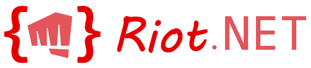

# 
## Just another .NET wrapper :)

Riot.NET is a wapper for Riot Games1 API targeting .NET 6 and above. If you are looking for a wrapper that targets older versions of .NET, try checking out [RiotSharp](https://github.com/BenFradet/RiotSharp)2.

## Prerequisites

The following requirement must be met before using Riot.NET

- Project must be running [.NET 6.0](https://dotnet.microsoft.com/download/dotnet/6.0)
- Must have a Riot Games [API Key](https://developer.riotgames.com/docs/portal#web-apis_api-keys)

## To-do list

Below is a list of items that are planned / need to be completed.

#### Requests / Persistence
- [ ] RequestBase
- [ ] Caching
- [ ] Repository

#### Riot API
- [ ] DTO
- [ ] Endpoints
- [ ] Exceptions
- [ ] Rate Limiter

#### Static (Data Dragon / Community Dragon)
- [ ] Version
- [ ] Champion Metadata
- [ ] Champion Image Tiles
- [ ] Champion Splash Art
- [ ] Champion Loading Screens
- [ ] Champion Icons
- [ ] Challenge Metadata
- [ ] Challenge Icons
- [ ] Player Profile Icons
- [ ] Player Rank Icons
- [ ] Player Honor Icons
- [ ] Ability Icons
- [ ] Mastery Icons
- [ ] Summoner Spell Icons
- [ ] Item Icons

## Disclaimers

1 Riot.NET is not in any way affiliated with Riot Games, Inc. or any of its subsidiaries. 
2 RiotSharp is a separately managed project that can change at any time. Riot.NET is not affiliated with RiotSharp in any capacity and assumes no liability for its usage.
